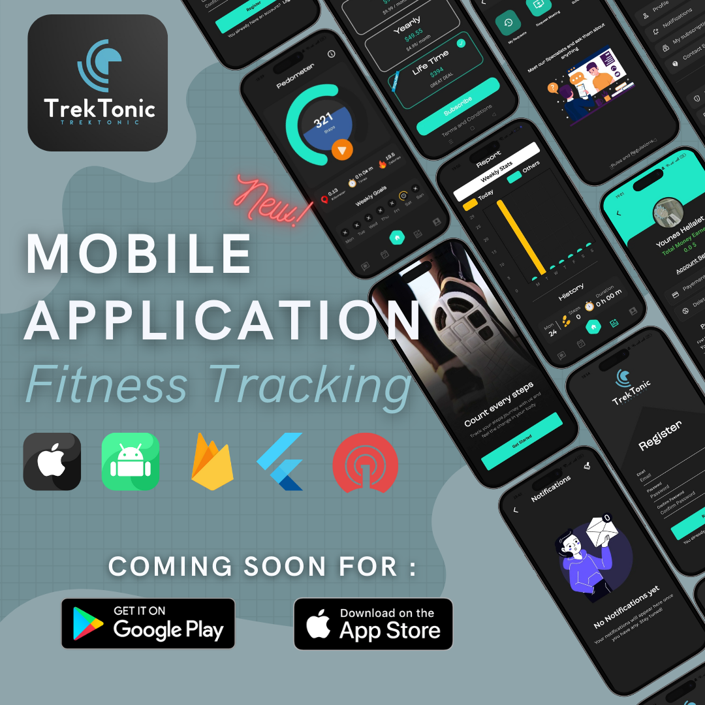
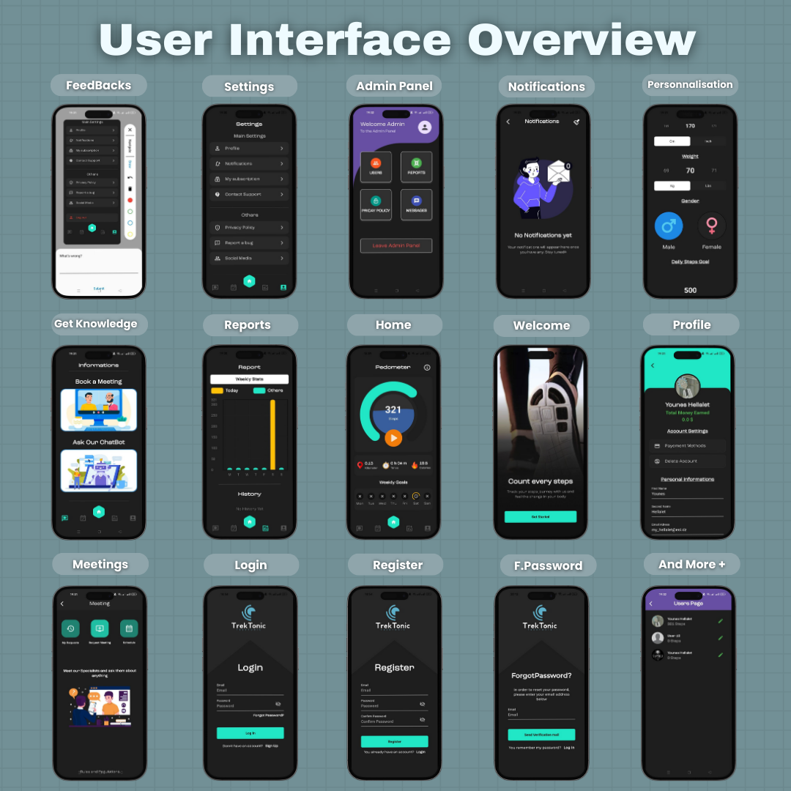
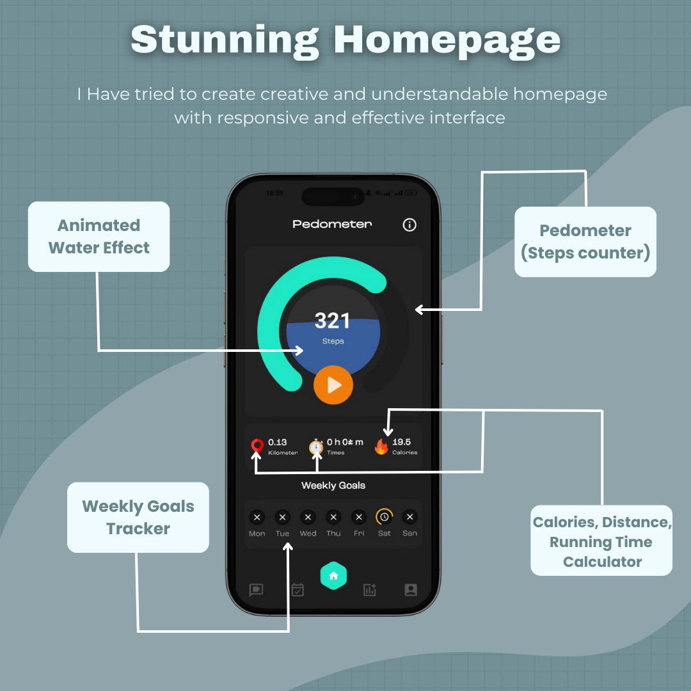
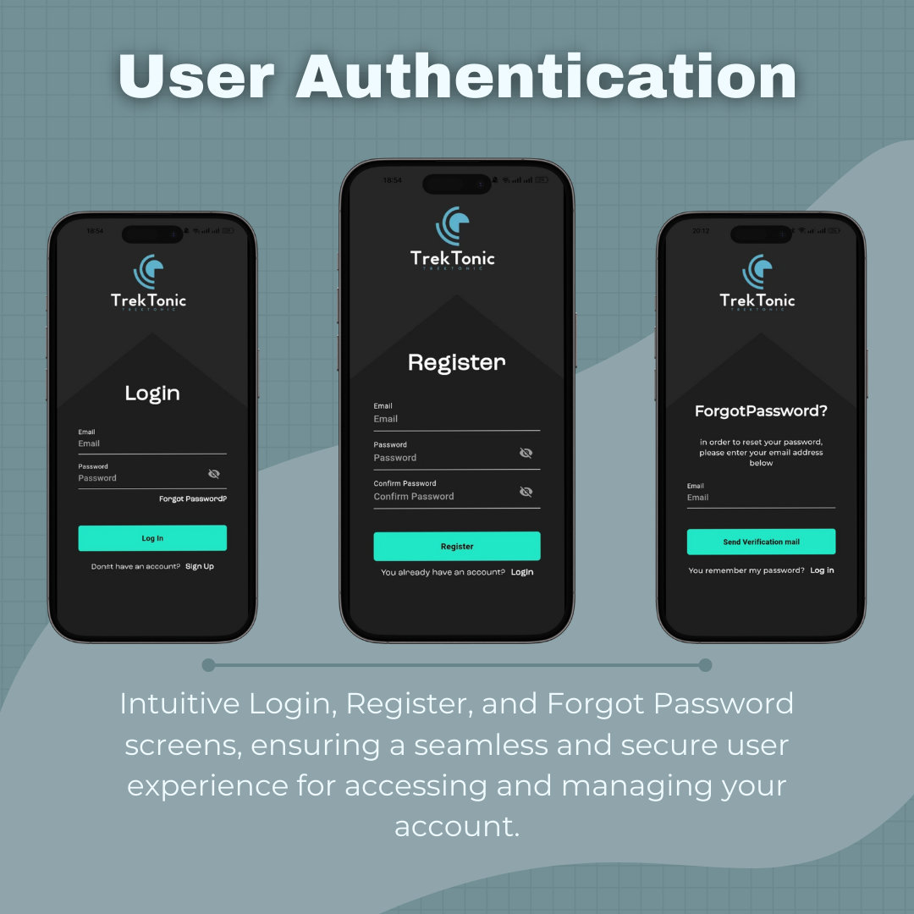
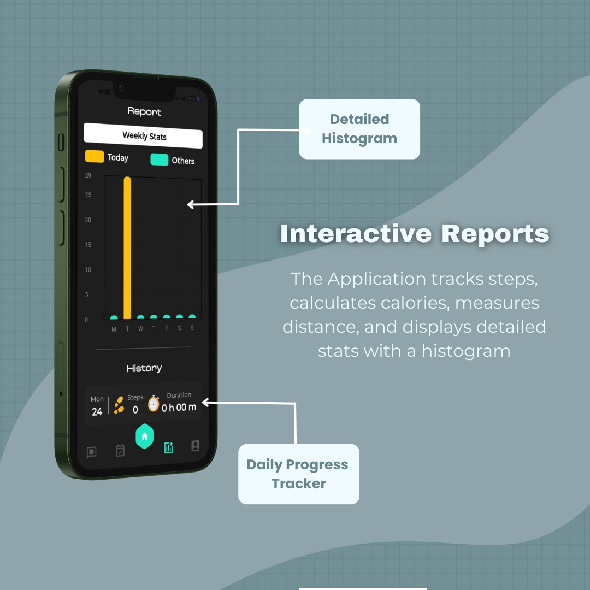
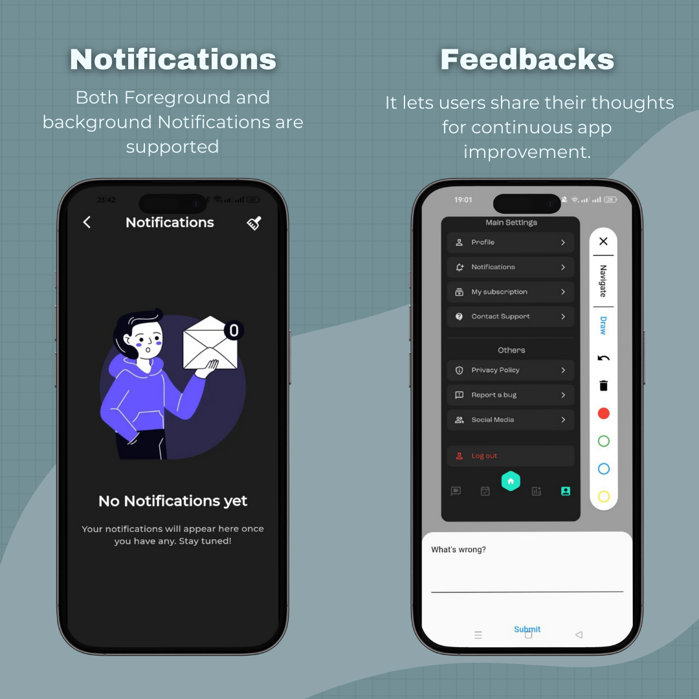
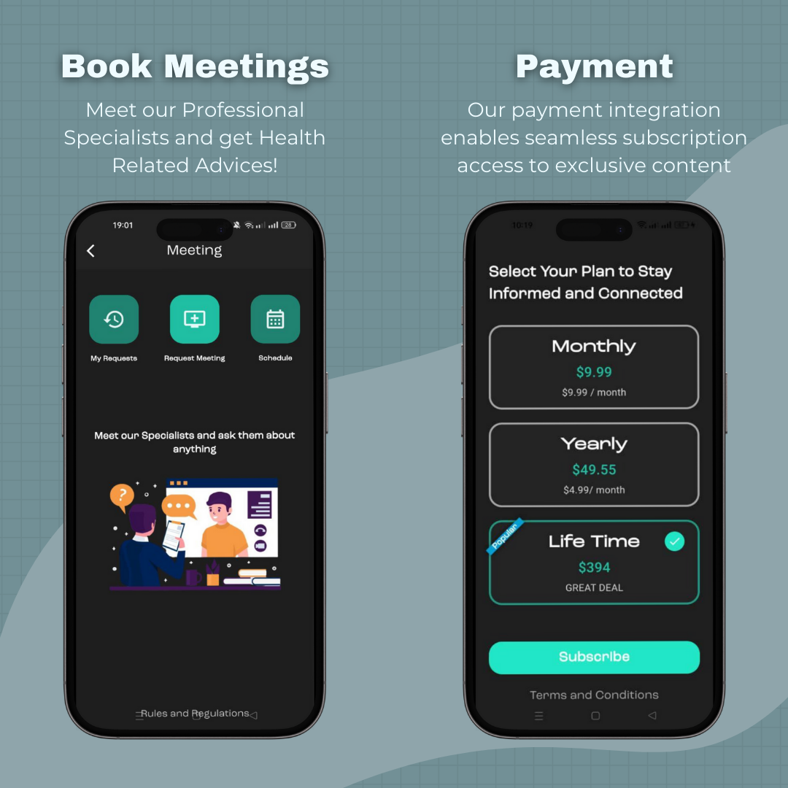
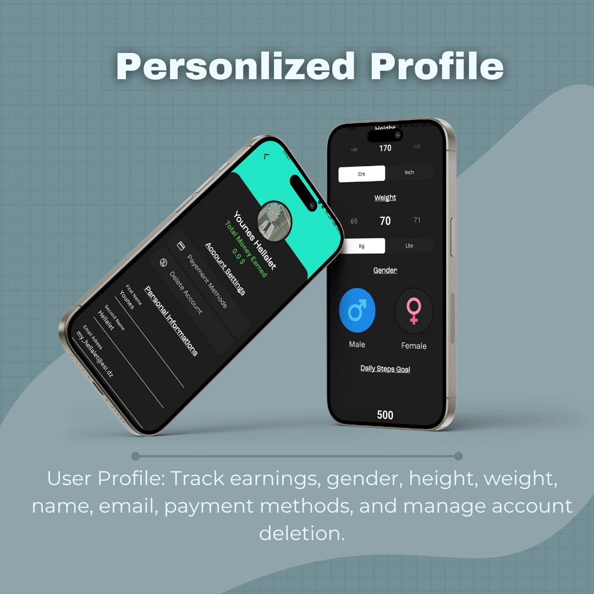
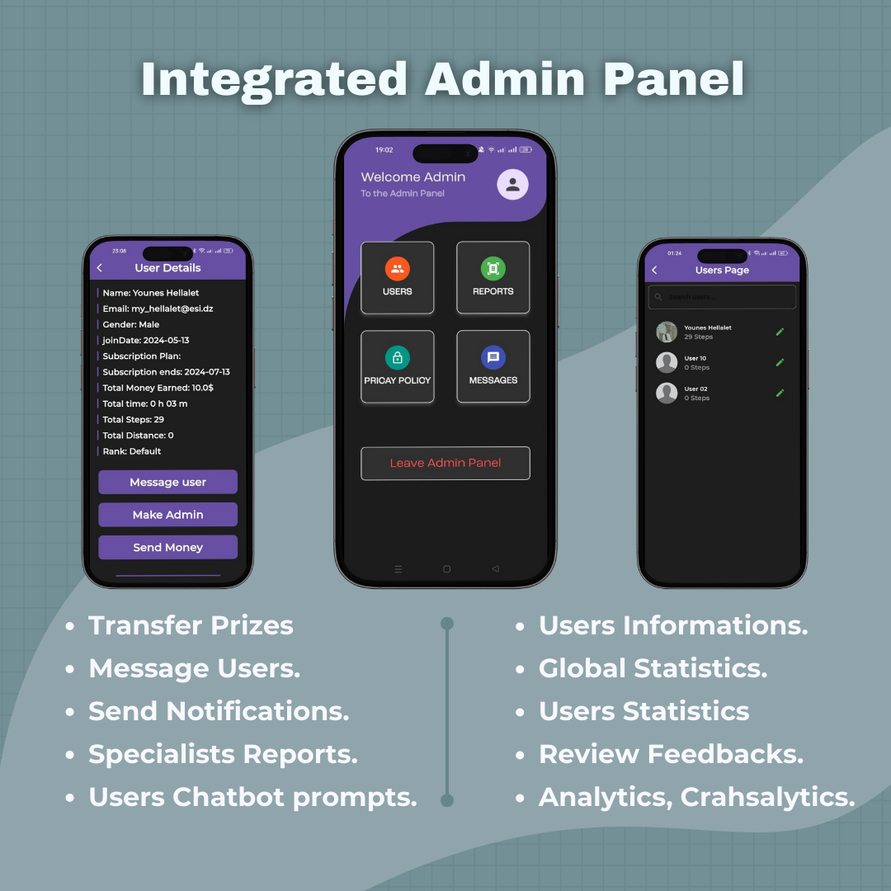
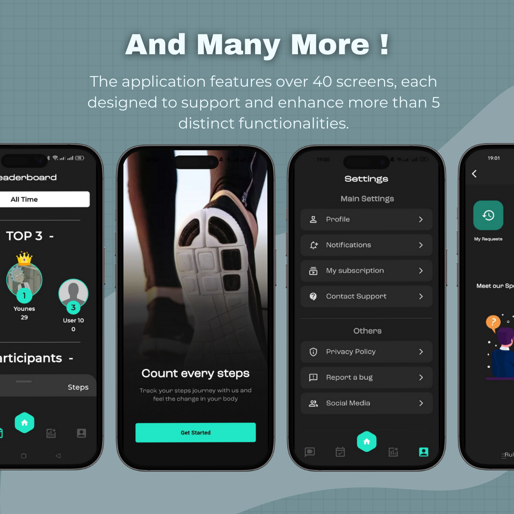

# TrekTonick: Earn Money by Walking 💵🚶

Introducing "TrekTonick" ⚡️, my latest mobile app developed in under 25 days for a client in Saudi Arabia. It's a unique fitness tracker that motivates users with monetary rewards ($10 for 5,000 steps) 🏃‍♂️💰 and provides expert advice through meetings with specialists and chats with our health-focused chatbot 🤖🩺.

## Posters

## Key Features
- 🏃‍♂️ **Pedometer**: Tracks steps based on user metrics.
- 🏆 **Leaderboard**: Highlights top walkers.
- 📊 **Statistics and Reports**: Monitors daily activity.
- 🤖 **Integrated Chatbot**: Uses Gemini API with safety settings.
- 📞 **Video and Audio Call Meetings**: Connects users with health specialists.
- 🖥️ **Integrated Admin Panel**: Manages app content and user settings.
- 💬 **Help Center Chat Channel**: Provides direct user support.
- 📝 **Feedback System**: Allows users to submit suggestions.
- 🎁🔔 **Prizes and Notifications Systems**: Rewards and notifies users.
- 💳 **Payment Integration**: Enables secure transactions within the app.

## Technologies Used
- **Flutter 📱**: for cross-platform development.
- **Firebase 🔥**: for backend services.
- **OneSignal 🔔**: for push notifications.
- **ZegoCloud 📹**: for Video & Audio Calls.
- **LocalStorage**: for data storage.
- **Localization**: for multi-language support.
- **Bloc**: as a state management solution.

For source code inquiries, please contact me at [hellalet.younes@gmail.com](mailto:hellalet.younes@gmail.com).
